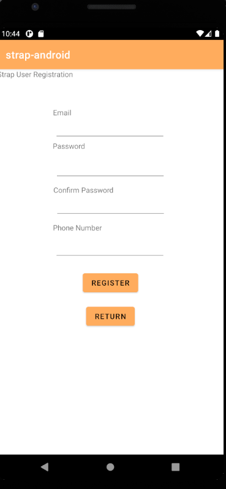
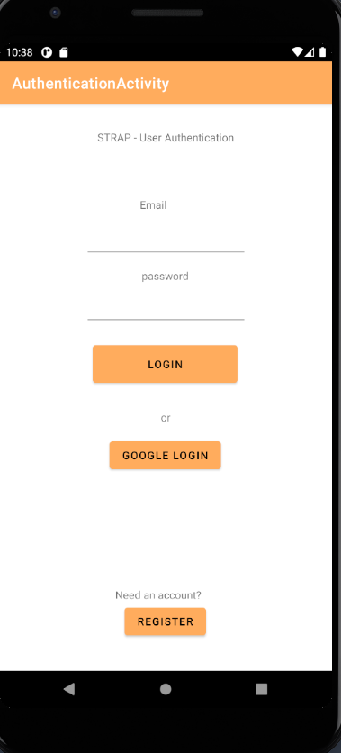
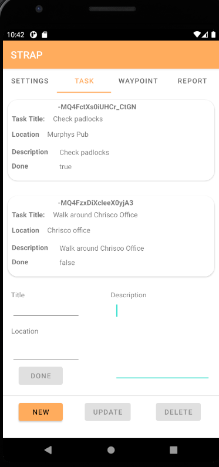
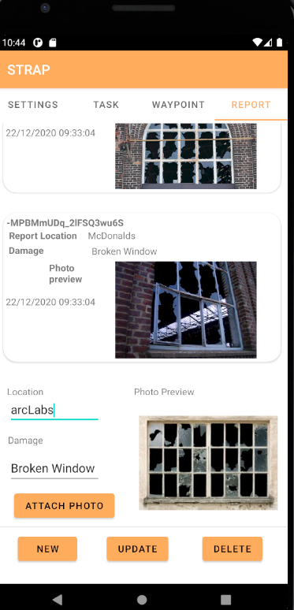
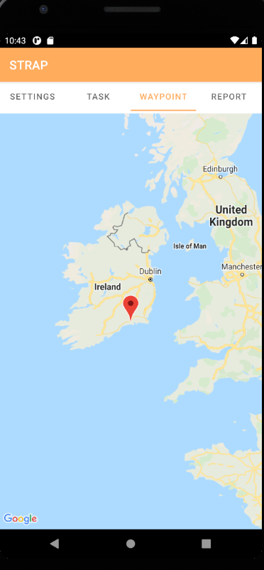

# strap-android
The android version of the Shift Tracking App

## Features
- Filtering of reports/tasks per user, each report/task is assigned under the UID of the user.
- Image chooser and upload
- Linked references of reports and respective attached photos

### User registration using email + password backed by Firebase Authentication

### User login with email + password backed by Firebase

### Task implementation with Firebase Realtime Database

### Report implementation with Firebase Realtime Database

## Planned features
- Extension to waypoints (currently doesn't read location data)
### Current waypoint implementation

